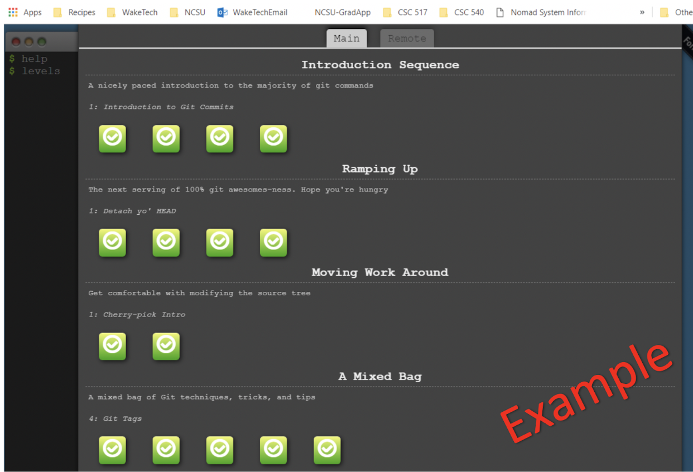
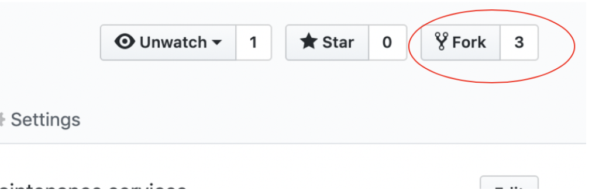
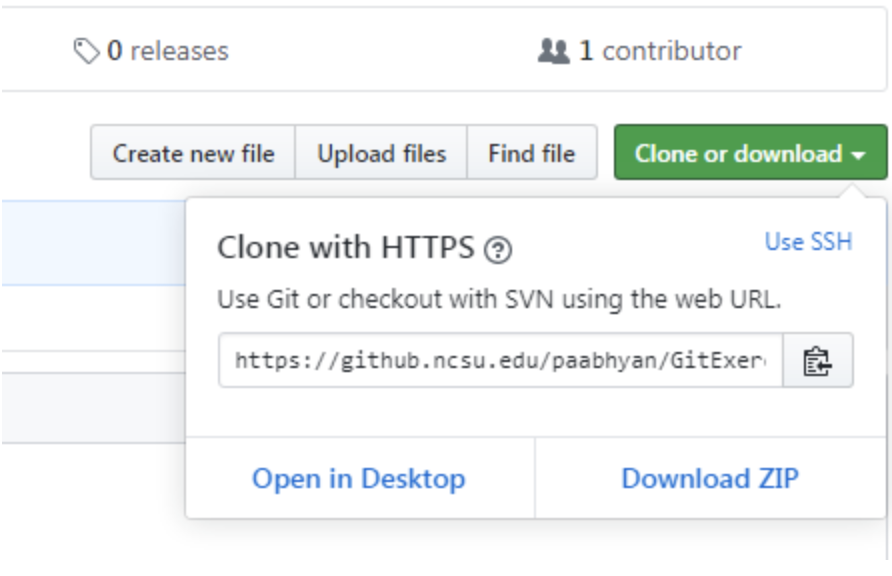
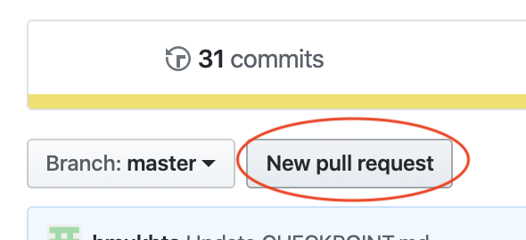

# Assignment 0 – GITHUB
## CSC/ECE 517 - Object Oriented Design & Development
[Lecture 1 - GitHub Project Board Introduction](link): _links the introduction presentation provided in class_
______
**Due Date** : Month dd, yyyy @ hh:mm am/pm
- _Assignment submission will be verified by the timestamps noted in the repository log_

**Goal** : Gain basic skills required in using Git for a shared codebase, as well as an initial understanding of GitHub Project Board capabilities.

**Piazza** : Feel free to post questions, observations, and tips to Piazza. _Do not post solutions_.

**Description** :	This Assignment is designed as an introductory exercise for NCSU GitHub Enterprise, GitHub Project Boards, and Git command sequences. There are several steps to this assignment and you are encouraged to complete them in sequence. Each of the tools introduced in this assignment will be used in this course. By the end, you should feel comfortable with applying the basics of these in future homework and projects.

**Notes** :
- For reference, a folder with example screenshots of steps can be 
accessed [here](link).
- Assignment tips can be viewed [here](link).

_______

**SetUp** :
1. Sign into [NCSU’s GitHub](https://github.ncsu.edu/)
- _If you have never accessed your NCSU GitHub account, a first time login with your NCSU unity id and password is all that is needed to set up the service._
2. Create a _private_ repo:
- Name it **CSC_ECE_517_Assignment1** and select the option to “initialize this repository with a README”.
3. Add the instructor and all TAs as collaborators using their Unity IDs.
```Bash
settings → collaborators
```
4. Watch the [GitHub Project Introduction Screencast](link).
- This presentation contains specific information about how to complete the remainder of this assignment.
5. Create a new private GitHub Project **(via the project tab of your repo)**
- Name it **CSC_ECE_517_Assignment1**
- Select the _Basic Kanban_ template, and link your assignment repository.
- You can set up your Project Board Columns in a variety of ways. Your board **must** include a _ToDO_, _InProgress_, and _Done_ column. You may reference the following [Project Board](https://github.com/carmenbentley/Assignment0/projects/1) as a template.
________
**GitHub Project Boards** :
- _Create Project issues/tasks for each of the following, moving them appropriately through the kanban board columns and closing the issue when completed._
```Bash
ToDo → InProgress → Done
```
- **Note**: as stated in the above presentation, GitHub Project Board Issues are also known as Tasks. Issues are a generalized card on the Project Board that can represent an item that needs to be completed, fixed, reconsidered, etc.
1. Issue 1
- **Label**: Assignment1 Todo
	- _This [new label](https://help.github.com/en/github/managing-your-work-on-github/creating-a-label) should be created__.
- **Assignees**: You are responsible for completing this Issue,a assign yourself to the task.
- **Description**: Complete all the levels in the following “Main” topics of the [Git Tutorial](http://pcottle.github.io/learnGitBranching/)
	- (1) Introduction Sequence
	- (2) Ramping Up
	- (3) Moving Work Around
	- (4) A Mixed Bag

_Once you have completed each of the levels required for this task, you should have learned the basics for understanding important git commands and sequences that will be helpful when completing group assignments using a shared code base, such as committing code, merging conflicts, branching, etc._
2. Issue 2
- **Label**: Assignment1 Todo
- **Assignees**: You are responsible for completing this Issue, assign yourself to the task.
- **Description**: Add a screenshot named _completedGitLevels.png_ to your CSC_ECE517_Assignment1 repository that captures your progress of the tutorial mentioned in Issue 1.

_This image will serve as evidence that you have completed the 
levels required. It will also give you an opportunity to experience adding files to your NCSU GitHub Repository. Below you will see an example screenshot of what your image should look like._


3. Issue 3
- **Label**: Assignment1 Todo
- **Assignee**: You are responsible for completing this Issue, assign yourself to the task.
- **Description**: [Embed](https://www.youtube.com/watch?v=hHbWF1Bvgf4) _completedGitLevels.png_ within your CSC_ECE_517_Assignment1 repository README.md

_This will give you an opportunity to work with a markdown file to embed an image into your README.md rather than just inserting a link. You will be required to do this in future assignments to enhance your project wiki pages._

4. Issue 4
- **Label**: Assignment1 Todo
- **Assignee**: yourself
- **Description**:
	- (1) Add a headshot as your profile picture for your NCSU GitHub account. _This picture should include only you and no other people._
	- (2) Update your public name to first and last name known at NCSU. 
	- (3) Update your public email to your ncsu email.
	- NOTE: if a course project requires use of a personal github repository, please complete the above steps for it as well. An individual headshot and well labeled user names are beneficial for your Professor, TAs, and mentors to become more familiar with whose assignments they are reviewing. “Putting a face to the name”.


5. Issue 5
- **Label**: grade request
	- _This [new label](https://help.github.com/en/github/managing-your-work-on-github/creating-a-label) should be created__.
	- _This should be labeled as 'grade request', as it is not an Assignment1 task that you yourself are responsible for completing._
- **Assignee**: assign all TAs to this task.
- **Description**: Request for Assignment0 to be graded.

___
**Putting git commands into practice** :
1. Visit the [GitPractice](https://github.com/carmenbentley/GitPractice) repository.
2. Fork the repository.
	
3. Clone your forked repository using the HTTPS clone url and create a branch.
	
```Bash
git clone [https_url]
git branch // list branches
git checkout -b [unityId] // create new branch from the current HEAD
git branch
git checkout [unityId] // switch to that branch
```
4. Add a new .txt file with your unity id as the file name (eg. paabhyan.txt).
5. Add content to the new .txt file that gives a brief introduction of who you are and your background. This can simply be a few sentences.
6. Stage and commit this change.
```Bash
git status // check changes currently staged
git add [filename] // stage changes
git status // check that change was staged
git commit -m “Commit message”
git push origin [unityId] // push branch changes to forked repo
```
7. Create a pull request. We suggest that you use the GitHub UI to do this. 


_This request will notify the repository owner of your requested change. He/She will then review the change and either approve or deny the merge._
_____
**Self Grading**:
1. Self-grade your assignment.

To complete this step, you should fill out the following assignment grading rubric, awarding and deducting points where appropriate. Once you have completed the rubric, you should include it in your README.md file in the assignment repository. You can do this one of two ways (1) embed a screenshot or (2) create the table using [markdown](https://github.com/adam-p/markdown-here/wiki/Markdown-Cheatsheet) formatting.


| Component                                                                                             | Possible Assignment Points | Partial Deductions * full deduction taken if component is missing                                                                                                                                                                                                                                                                                                                                                                             | Assignment Points Earned |
|-------------------------------------------------------------------------------------------------------|----------------------------|-----------------------------------------------------------------------------------------------------------------------------------------------------------------------------------------------------------------------------------------------------------------------------------------------------------------------------------------------------------------------------------------------------------------------------------------------|--------------------------|
| 1. Create a private repo with correct name.                                                           | 4 points                   | (–1) repo is public<br/>(–1) repo name is incorrect                                                                                                                                                                                                                                                                                                                                                                                               |                          |
| 2. Repo contains a README.md file                                                                     | 2 points                   | (–1) README is of different file type (ex: .txt)                                                                                                                                                                                                                                                                                                                                                                                              |                          |
| 3. Repo includes all required Collaborators                                                           | 2 points                   | (–1) not all TAs are included as Collaborators                                                                                                                                                                                                                                                                                                                                                                                                |                          |
| 4. Created a private project with correct name.                                                       | 4 points                   | (–1) project is public (–1) project name is incorrect                                                                                                                                                                                                                                                                                                                                                                                         |                          |
| 5. Project is accessible via the assignment repo project tab.                                         | 2 points                   | None                                                                                                                                                                                                                                                                                                                                                                                                                                          |                          |
| 6. Repo contains a .png file named completedGitLevels                                                 | 2 points                   | (–1) file extension of file is different than .png (ex: .jpg) <br/>(–1) filename is not completedGitLevels                                                                                                                                                                                                                                                                                                                                         |                          |
| 7. completedGitLevels.png has been embedded in the repo README                                        | 2 points                   | (–1) file is linked and not embedded in the README                                                                                                                                                                                                                                                                                                                                                                                            |                          |
| 8. Completed all 15 levels of the online git tutorial.                                                | 15 points                  | (–1) for each level that is not completed                                                                                                                                                                                                                                                                                                                                                                                                     |                          |
| 9. Project Board Issue #1                                                                             | 8 points                   | (–1) incorrect Label (–1) incorrect Assignee <br/>(–1) Description is does not accurately describe the issue/task <br/>(–1) Issue did not move through the ToDo column <br/>(–1) Issue did not move through the InProgress column <br/>(–1) Issue did not move through the Done column <br/>(–1) Issue is not closed <br/>(–1) Issue not completed on time                                                                                                                  |                          |
| 10. Project Board Issue #2                                                                            | 8 points                   | (–1) incorrect Label <br/>(–1) incorrect Assignee <br/>(–1) Description is does not accurately describe the issue/task <br/>(–1) Issue did not move through the ToDo column <br/>(–1) Issue did not move through the InProgress column <br/>(–1) Issue did not move through the Done column <br/>(–1) Issue is not closed <br/>(–1) Issue not completed on time                                                                                                                  |                          |
| 11. Project Board Issue #3                                                                            | 8 points                   | (–1) incorrect Label <br/>(–1) incorrect Assignee <br/>(–1) Description is does not accurately describe the issue/task <br/>(–1) Issue did not move through the ToDo column <br/>(–1) Issue did not move through the InProgress column <br/>(–1) Issue did not move through the Done column <br/>(–1) Issue is not closed <br/>(–1) Issue not completed on time                                                                                                                  |                          |
| 12. Project Board Issue #4                                                                            | 11 points                  | (–1) incorrect Label <br/>(–1) incorrect Assignee <br/>(–1) Description is does not accurately describe the issue/task <br/>(–1) Issue did not move through the ToDo column <br/>(–1) Issue did not move through the InProgress column <br/>(–1) Issue did not move through the Done column <br/>(–1) Issue is not closed <br/>(–1) Issue not completed on time <br/>(–1) Headshot not appropriately updated <br/>(–1) Email not appropriately updated <br/>(–1) Name not appropriately updated |                          |
| 13. Project Board Issue #5                                                                            | 6 points                   | (-1) incorrect Label <br/>(-1) incorrect Assignee <br/>(-1) Description does not accurately describe the issue/task.                                                                                                                                                                                                                                                                                                                                    |                          |
| 14. Completed Assignment Rubric is embedded in README.md or included via markdown formatting.         | 2 points                   | None                                                                                                                                                                                                                                                                                                                                                                                                                                          |                          |
| 15. Pull request received with new file [<unityid>.txt] requested to be merged into GitPractice repo. | 2 points                   | None                                                                                                                                                                                                                                                                                                                                                                                                                                          |                          |
	
Your final grade will be computed based on 3 randomly selected rows from the above Assignment Grading Rubric.
**Example**:
- Grading based on scores accumulated from rows 1, 8, and 12. Your grade will then be given based on the percentage of assignment points earned from the total possible assignment points of those rows. 

	Possible Example Grading Results: 18 possible assignment points

| 18/18 = 100% <br/>17/18 = 94% <br/>16/18 = 89% <br/>15/18 = 83% <br/>14/18 = 78% <br/>13/18 = 72% <br/>12/18 = 67% | 11/18 = 61% <br/>10/18 = 56% <br/>9/18 = 50% <br/>8/18 = 44% <br/>7/18 = 39% <br/>6/18 = 33% | 5/18 = 28% <br/>4/18 = 22% <br/>3/18 = 17% <br/>2/18 = 11% <br/>1/18 = 6% <br/>0/18 = 0% |
|--------------------------------------------------------------------------------------|---------------------------------------------------------------------|-----------------------------------------------------------------|


The percentage of assignment points earned will be translated as a percentage of course points that you earned for this assignment.

**Example** :
- Assignment 1 is worth 10 course points and you earned 94% of the possible assignment points. This translates to earning 9.4 course points.

